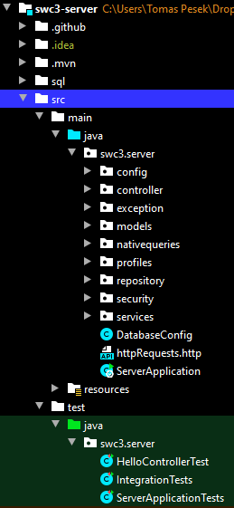
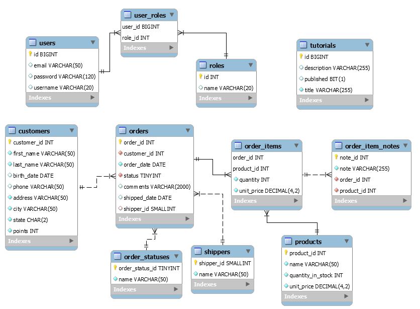
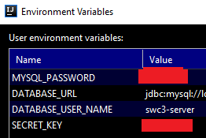
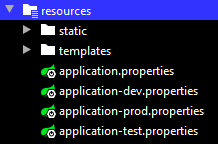

# Spring Boot Web Server

### App structure

### Implemented:
- RestControllers
- Models
- Repositories

### Database
- Dependencies:
    - spring-boot-starter-data-jpa
    - mysql-connector-java 
- The self-contained dump file for the database is in sql folder: swc3_springboot_dump.sql
- Create that database and make sure it is used as a data source by the web server - via application.properties
- Database EER:

### application.properties
- using environment variables: 
    - example: spring.datasource.url=${DATABASE_URL}

### Profiles
- Profiles are defined by application.properties using naming conventions:

- Like this we get dev, prod, test profiles.
- The active profile is checked by the default application.properties:
    - spring.profiles.active=@spring.profiles.active@
- We can work with the dev profile and push to the gitHub with prod profile - done via .github/workflows/maven.yml:
run: 
    - mvn -B package -P prod --file pom.xml 

### Logging
- in application.properties:
    - logging.level.org.springframework = INFO
    - logging.level.sql = debug (we will see all the sql queries in the console)

###Features
- Implemented REST APIs for http communication like GET, POST, PUT, DELETE - for client-side rendering.
- Custom Exception Handler
- Pagination
- Filtering
- Sorting
- Thymeleaf server-side rendering: in TutorialControllerForThymeleaf
- spring-boot-starter-data-rest to automatically generate the REST APIs: 
    - https://spring.io/guides/gs/accessing-data-rest/

### Testing
- dependency: spring-boot-starter-test
- Integration tests for the database (done directly on the production database)

### gitHub CI action
.github/workflows/maven.yml: this allows us to create Java continuous integration with Maven,
after pushing to gitHub, the CI action gets executed (tests), if successful, the app will be automatically deployed to heroku cloud:
https://docs.github.com/en/actions/guides/building-and-testing-java-with-maven

### CORS
- configured in the file WebConfig: allowedMethods, allowedOrigins, etc.

### Spring security
- dependency: spring-boot-starter-security
- configuration: in the file WebSecurityConfig
- Authentication: registration / login
- Authorization: APIs are accessible to different roles - example: @PreAuthorize("hasRole('ADMIN')")
- https://spring.io/guides/topicals/spring-security-architecture
- https://spring.io/guides/gs/securing-web/ 

### local database server time zone error
If you get an error because of the timezone, run the following command in MySQL Workbench:
- SET @@global.time_zone = '+00:00';

### Endpoints
- http://localhost:5557/api/tutorials
- http://localhost:5557/api4/tutorials-all-sorted?sort=id,desc&sort=title,asc
- http://localhost:5557/thymeleaf/tutorialsAdvanced
- http://localhost:5557/api/orders
- http://localhost:5557/api/ordersWithIDs
- etc...

### Http requests
httpRequests.http file contains some http requests:

- registration: POST http://localhost:5557/api/auth/signup, provide username, password, email
- login (getting JWT), provide username, password
- authorized request (using acquired JWT)
- tests