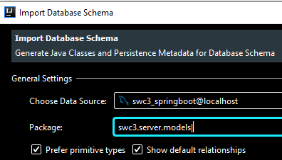
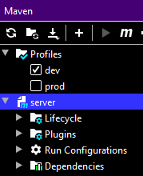
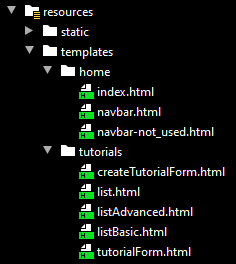
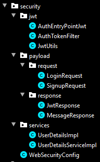
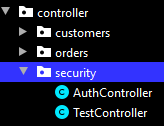
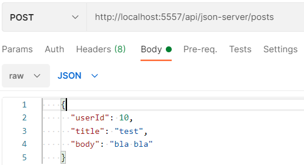
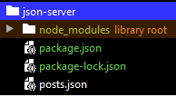
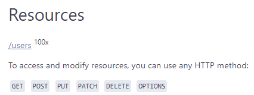
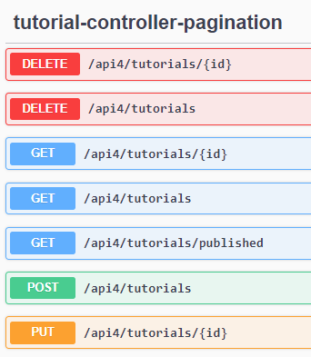
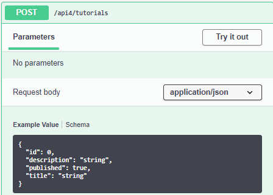

# Spring Boot Web Server

### App structure


### Implemented:
- RestControllers
- Models (using javax.persistence, model classes were generated from the existing database)


- using annotation @JsonBackReference to avoid a JSON loops.
- Repositories: dependency: spring-boot-starter-data-jpa: [JpaRepository](https://docs.spring.io/spring-data/jpa/docs/current/api/org/springframework/data/jpa/repository/JpaRepository.html)

### Database
- Dependencies:
    - spring-boot-starter-data-jpa
    - mysql-connector-java 
- The self-contained dump file for the database is in sql folder: swc3_springboot_dump.sql
- Create that database and make sure it is used as a data source by the web server - via application.properties
- Database EER:


### application.properties
- using environment variables: 
#####
    spring.datasource.url=${DATABASE_URL}


### Maven
This is a Maven project:



### Profiles
- Profiles are defined by Maven (pom.xml):
#####       
    <profiles>
            <profile>
                <id>dev</id>...
- Profiles are accessed by the application.properties using naming conventions:


- Like this we get dev, prod, test profiles.
- The active profile is checked by the default application.properties:
```text
     spring.profiles.active=@spring.profiles.active@
```

- We can work with the dev profile and push to the gitHub with prod profile - done via .github/workflows/maven.yml:
```yaml
    run: 
        - mvn -B package -P prod --file pom.xml 
```

### Logging
- in application.properties:
```text   
    logging.level.org.springframework = INFO
    logging.level.sql = debug (we will see all the sql queries in the console)
```

### Features
- Implemented REST APIs for http communication like GET, POST, PUT, DELETE - for client-side rendering.
- Custom Exception Handler
- Pagination
- Filtering
- Sorting
- spring-boot-starter-data-rest to automatically generate the REST APIs: 
    - https://spring.io/guides/gs/accessing-data-rest/
- 

### Thymeleaf [docs](https://www.thymeleaf.org/)
- server-side template engine: in TutorialControllerForThymeleaf
- multi-page web application, the web app sends the whole html page as a response.


### Testing
- dependency: spring-boot-starter-test
- Integration tests for the database (done directly on the production database)

### gitHub CI action
- .github/workflows/maven.yml: 

This allows us to create Java continuous integration with Maven,
after pushing to gitHub, the CI action gets executed (tests), if successful, the app will be automatically deployed to heroku cloud:
[github actions with maven](https://docs.github.com/en/actions/guides/building-and-testing-java-with-maven)
- Specify Java JDK and java-version:
```yaml
        steps:
        - uses: actions/checkout@v2
        - name: Set up JDK 11
          uses: actions/setup-java@v1
          with:
            java-version: 11
```

- User environment variables on github:
```yaml
      env:
        DATABASE_URL: ${{secrets.DATABASE_URL}}
        SECRET_KEY: ${{secrets.SECRET_KEY}}
```

### CORS
- configured in the file WebConfig: [Spring CORS](https://spring.io/guides/gs/rest-service-cors/)
    - allowedMethods 
    - allowedOrigins
    - allowCredentials
    - maxAge
    - allowedHeaders
    - ExposedHeaders

### Spring security
 

- dependency: spring-boot-starter-security [Spring Security reference](https://docs.spring.io/spring-security/site/docs/5.4.6/reference/html5/)
- configuration: in the file WebSecurityConfig
- Authentication: registration / login
- Authorization: APIs are accessible to different roles - example: @PreAuthorize("hasRole('ADMIN')")
- <https://spring.io/guides/topicals/spring-security-architecture>
- <https://spring.io/guides/gs/securing-web> 

To disable the Spring security, go to WebSecurityConfig and use permitAll() on all endpoints:
```java
	protected void configure(HttpSecurity http) throws Exception {
        ...
        .antMatchers("/**").permitAll() //disabling the spring authentication
        ...
```

- During the registration the password is encrypted. During the login, it is decrypted.
```java
    org.springframework.security.crypto.password.PasswordEncoder;
    PasswordEncoder encoder.encode("mypassword");
```

- Authentication is using a JWT - JSON Web Token which is given to the client by the login endpoint if the credentials are correct.
- Authorization is using roles. A user can have multiple roles. Each endpoint can be set up for specific roles:
```java
    @PreAuthorize("hasRole('ADMIN')")
    @GetMapping("/customers")
    public ResponseEntity<List<Customer>> getAllCustomers() {...
```

- registration endpoint: 
    - POST <http://localhost:5557/api/auth/signup>, provide username, password, email, (array of roles)
- login endpoint (providing the JWT to the client) 
    - POST <http://localhost:5557/api/auth/signin>, provide username, password 

### local database server time zone error
If you get an error because of the timezone, run the following command in MySQL Workbench:
```mysql
    SET @@global.time_zone = '+00:00';
```

### REST APIs (Endpoints providing data in JSON format)
- <http://localhost:5557/api/tutorials>
- <http://localhost:5557/api4/tutorials-all-sorted?sort=id,desc&sort=title,asc>
- <http://localhost:5557/thymeleaf/tutorialsAdvanced>
- <http://localhost:5557/api/orders>
- <http://localhost:5557/api/ordersWithIDs>
- etc...

### Http requests [IntelliJ documentation](https://www.jetbrains.com/help/idea/exploring-http-syntax.html)
httpRequests.http file:

- registration: 
    - POST <http://localhost:5557/api/auth/signup>, provide username, password, email, (array of roles)
- login (getting JWT) 
    - POST <http://localhost:5557/api/auth/signin>, provide username, password 
- authorized request (using acquired JWT)
- tests:

```html
        > 
```

- **HttpRequests in HTTP format:**:
```http request
        POST http://localhost:5557/api/json-server/posts HTTP/1.1
        Content-Type: application/json
        
        {
        "userId": 10,
        "title": "test",
        "body": "bla bla"
        }
```

- **HttpRequests in PowerShell:**:
```bash
    $headers = New-Object "System.Collections.Generic.Dictionary[[String],[String]]"
    $headers.Add("Content-Type", "application/json")
    
    $body = "    {
    `n      `"userId`": 10,
    `n      `"title`": `"test`",
    `n      `"body`": `"bla bla`"
    `n    }"

    $response = Invoke-RestMethod 'http://localhost:5557/api/json-server/posts' -Method 'POST' -Headers $headers -Body $body
    $response | ConvertTo-Json
```

- **HttpRequests in Postman:**:



### Changing the data source
- change the connection string in application.properties
- change the Hibernate dialect: [hibernate.dialect](https://docs.jboss.org/hibernate/orm/5.2/javadocs/org/hibernate/dialect/package-summary.html)
```text
    spring.jpa.properties.hibernate.dialect= org.hibernate.dialect.MySQL5InnoDBDialect
```

### Lombok
- dependency: lombok [lombok maven](https://projectlombok.org/setup/maven)
- We can use annotations like these:
```java
    @EqualsAndHashCode
    @Setter
    @Getter
    @NoArgsConstructor
```
Our code will be cleaner.

### HttpClient
- Showing how to send an http request and how to handle the response
- library: java.net.http.HttpClient
- using a public API to get some data: [regres.in](https://reqres.in/api/users)
- using a public API [jsonplaceholder](https://jsonplaceholder.typicode.com/)
- dependency: jackson-databind: class ObjectMapper:
    - Mapping response string into an object: 
```java
        Data data = mapper.readValue(response.body(), new TypeReference<Data>() {});
```

### Json-server [json-server npm](https://www.npmjs.com/package/json-server)

- Fake REST API generated from a json file.
- Install json-server (npm install json-server) ... this will install the dependencies in node_modules
- package.json:
```json
      "scripts": {
        "start": "json-server --watch ./posts.json"
      },
```     

- Run json-server: **npm start**: <http://localhost:3000/posts>
- Or run: **npx json-server data.json**
- Generate data for json-server: (Install packages faker and lodash)
```bash
    npm install faker lodash
```
- [npm faker](https://www.npmjs.com/package/faker)
- [npm lodash](https://www.npmjs.com/package/lodash)

- Create js function generate.js:
```javascript
    module.exports = function () {
        let faker = require("faker");
        let _ = require("lodash");
    
        return {
            users: _.times(100, function(n){
                return{
                    id: n,
                    name: faker.name.findName(),
                    avatar: faker.internet.avatar()
                }
            })
        }
    }    
```
- run json-server with this function:
```bash
    npx json-server generate.js
```

- Now we have an API people with 100 json objects which were generated by that function.


- We have all the CRUD features. If we POST new data, we can save it by executing "s" command. 
It will create a snapshot json file.

[json-server github](https://github.com/typicode/json-server)

- There are many features like sorting, pagination, etc.:

    <http://localhost:3000/users?_sort=first_name&_order=desc>

- Add custom routes:
    - Create routes.json
```json
        {
          "/resources/:year": "/resources?year=:year"
        }
```

Run the server with routes: **npx json-server data.json --routes routes.json**

Now We have an extra route: <http://localhost:3000/resources/2005>

- We can also deploy our json-server app on Heroku, Azure etc. and have our public fake api running.

### system.properties
    java.runtime.version=11
This is for Heroku cloud - it tells is to use java 11 buildpack.

### Rest API documentation [springdoc](https://springdoc.org)
- Dependencies:
    - springdoc-openapi-data-rest
    - springdoc-openapi-ui

In application properties:
```text
    springdoc.swagger-ui.path=/swagger-ui-custom.html
    springdoc.swagger-ui.operationsSorter=method
    springdoc.api-docs.path=/api-docs
```

Access the documentation: (app running on port 5557)
- <http://localhost:5557/api-docs> (api-docs in JSON format)
- <http://localhost:5557/swagger-ui-custom.html> (Swagger)




### Docker
- comming soon...

### Markdown tutorial

[](https://www.youtube.com/watch?v=HUBNt18RFbo)
